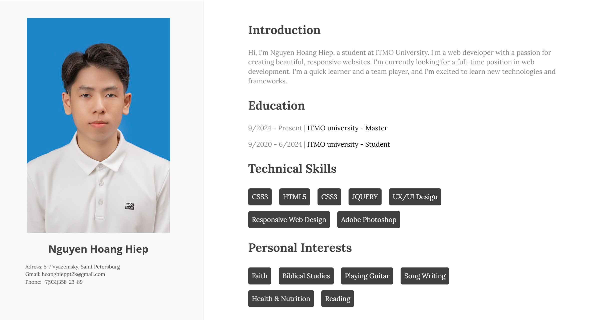

# My Profile

A basic website describing my personal profile.
On the frontend, basic HTML, CSS techniques are used, and on the backend, Flask is used.
I created two basic pages, basic.html and advanced.html, with similar content. However, basic.html contains static files and is routed by default, while advanced.html uses information variables (name, address, gmail and phone) and is called in the advanced.py file with a redirect to /profile.

You can watch it through this link: "https://hoanghieppt2k.github.io/nguyenhoanghiep.github.io/"
